# かんたん動画 Standalone テクニカルガイド

このドキュメントは `simple_video_app` 向けの技術情報に限定しています。

## 1. スコープ

- 対象: Standalone版 `simple_video_app`
- 非対象: distributed構成、マルチユーザー運用、本家Webアプリ全体機能

## 2. 実行構成

- サーバ: `simple_video_app/app.py`（FastAPI）
- フロント: `simple_video_app/static/index.html` + `static/js/*.js`
- 推論実行先: ComfyUI（既定 `127.0.0.1:8188`）

役割:

- フロントは同一オリジンAPIに接続
- サーバはワークフロー適用・ジョブ管理・出力配信を実施
- ComfyUIの `/prompt` `/history` `/progress` を利用

## 3. 主要ディレクトリ

- `simple_video_app/static/`: UI配信ファイル
- `simple_video_app/docs/`: Help/Guide文書
- `simple_video_app/output/`: Standalone側の成果物配置先
- `simple_video_app/data/`: 状態保存・参照画像インデックス
- `workflows/`: 使用ワークフローJSON

## 4. APIの要点（Standalone）

代表的なAPI:

- `GET /api/v1/workflows`: 利用可能ワークフロー一覧
- `POST /api/v1/generate`: 生成ジョブ投入
- `GET /api/v1/status/{job_id}`: ジョブ状態取得
- `GET /api/v1/download/{job_id}/{filename}`: 成果物ダウンロード
- `POST /api/v1/jobs/{job_id}/interrupt`: ジョブ中断
- `DELETE /api/v1/jobs/{job_id}`: ジョブ削除
- `GET /api/v1/simple-video/help/{doc_key}`: Help文書取得

## 5. ヘルプ配信方式

`SIMPLE_VIDEO_HELP_DOCS` に `doc_key -> ファイル` を定義し、
`/api/v1/simple-video/help/{doc_key}` でMarkdownを返却します。

現在のキー:

- `tutorial` → `HELP_JP.md`
- `guide` → `USAGE_JP.md`
- `technical` → `TECHNICAL_JP.md`

フロント側は `static/js/bootstrap.js` のフローティングパネルで表示し、
Help内部リンク（`/api/v1/simple-video/help/...`）は同パネル内で遷移します。

## 6. ワークフロー固定方針

`static/js/simple_video_config.js` で主要ワークフローを固定し、
Standalone利用時の挙動を安定化しています。

例:

- T2I: `qwen_t2i_2512_lightning4`
- I2I: `qwen_i2i_2511_bf16_lightning4`
- T2V: `qwen22_t2v_4step`
- I2V: `wan22_i2v_lightning`
- FLF: `wan22_smooth_first2last`
- 背景削除: `remove_bg_v1_0`（背景削除ON時の前処理）

## 7. エラーハンドリング要点

- `/prompt` 失敗時はレスポンス本文を付加して原因追跡しやすくする
- `node_errors` を含むComfyUIエラーをそのまま確認可能
- 出力探索は複数候補ディレクトリを順に探索
- 古い `job_id` でも実ファイルがあれば後方互換的に配信を試行

## 8. 既知の制約

- single-user前提
- distributed非対応
- Utility機能はStandaloneでは未対応
- ComfyUI側に必要workflowが存在しない場合は実行不可

## 9. 変更時のチェックポイント

1. `app.py` のAPI仕様とフロント呼び出し整合
2. Help文書キーの追加時は `SIMPLE_VIDEO_HELP_DOCS` を更新
3. ワークフローID変更時は `simple_video_config.js` とUI側分岐を同時更新
4. 出力配信パス変更時は `download` の探索ロジックも確認

## 10. 必須モデル（正式ファイル名）

以下は Standalone 既定 workflow で参照されるモデル名です。
ファイル名不一致時はモデルロードに失敗します。

### 10.1 Qwen Image 系（T2I / I2I）

```
共通
├── CLIPLoader:      text_encoders/  qwen_2.5_vl_7b_fp8_scaled.safetensors
└── VAELoader:       vae/            qwen_image_vae.safetensors

2512 系（T2I / I2I 画像生成）
└── UNETLoader:      diffusion_models/  qwen_image_2512_fp8_e4m3fn.safetensors        ← ベース
    └── LoraLoader:  loras/             Qwen-Image-Lightning-4steps-V1.0.safetensors ← 4step 高速化

2511 系（I2I 画像編集 / キャラ合成）
└── UNETLoader:      diffusion_models/  qwen_image_edit_2511_bf16.safetensors                    ← ベース
    └── LoraLoader:  loras/             Qwen-Image-Edit-2511-Lightning-4steps-V1.0-bf16.safetensors ← 4step 高速化
```

- 2512 と 2511 の LoRA は各ベース専用（互換性なし）
- `--image-model 2511` 運用時は 2512 系の 2 ファイルが不要（→ 10.4 参照）

### 10.2 Wan2.2 系（T2V / I2V / FLF）

Wan2.2 は 2 段階ノイズ除去のため、高ノイズ用と低ノイズ用のモデルを常にペアでロードします。

```
共通
├── VAELoader:       vae/             wan_2.1_vae.safetensors
└── CLIPLoader:      text_encoders/   umt5_xxl_fp8_e4m3fn_scaled.safetensors
                                      （I2V のみ umt5_xxl_fp16.safetensors も使用）

T2V（テキスト→動画）
├── 高ノイズ段（step 0→2）
│   └── LoaderGGUF:  diffusion_models/  wan2.2_t2v_high_noise_14B_Q4_K_M.gguf                    ← ベース
│       └── LoraLoader:  loras/         wan2.2_t2v_lightx2v_4steps_lora_v1.1_high_noise.safetensors ← 4step
└── 低ノイズ段（step 2→4）
    └── LoaderGGUF:  diffusion_models/  wan2.2_t2v_low_noise_14B_Q5_K_M.gguf                     ← ベース
        └── LoraLoader:  loras/         wan2.2_t2v_lightx2v_4steps_lora_v1.1_low_noise.safetensors  ← 4step

I2V / FLF（画像→動画 / 先頭末尾フレーム補間）  ※Seko-V1 LoRA 使用
├── 高ノイズ段（step 0→2）
│   └── UNETLoader:  diffusion_models/  wan2.2_i2v_high_noise_14B_fp8_scaled.safetensors   ← ベース
│       └── LoraLoader:  loras/         high_noise_model.safetensors                       ← Seko-V1 LoRA
└── 低ノイズ段（step 2→4）
    └── UNETLoader:  diffusion_models/  wan2.2_i2v_low_noise_14B_fp8_scaled.safetensors    ← ベース
        └── LoraLoader:  loras/         low_noise_model.safetensors                        ← Seko-V1 LoRA
```

- T2V と I2V の UNET / LoRA は互換性なし（別モデル）
- FLF は I2V と同じモデルスタックを共有
- `high_noise_model` / `low_noise_model` は Seko-V1 LoRA のワークフロー内参照名。入手した LoRA をこのファイル名にリネームまたはシンボリックリンクして `loras/` に配置すること

### 10.3 ACE-Step（T2A）

- `ace_step_1.5_turbo_aio.safetensors`

### 10.4 モデル代替（起動オプションで切り替え）

`qwen_image_2512_fp8_e4m3fn.safetensors` が入手できない／VRAMに収まらない場合、
起動時に `--image-model 2511` を指定するだけで 2511 系のみの運用に切り替わります。

```bash
# 既定（2512 使用）
./start.sh

# 2511 のみで運用
./start.sh --image-model 2511
```

内部動作:
- `start.sh` が環境変数 `SIMPLE_VIDEO_IMAGE_MODEL=2511` を設定
- `app.py` が `/js/simple_video_config.js` リクエストを `simple_video_config_2511.js` に差し替え
- フロント側は通常どおり設定を読み込む（変更不要）

2511 運用時に**不要**になるモデル:
- `qwen_image_2512_fp8_e4m3fn.safetensors`
- `Qwen-Image-Lightning-4steps-V1.0.safetensors`

2511 運用時に**必須**のモデル:
- `qwen_image_edit_2511_bf16.safetensors`
- `Qwen-Image-Edit-2511-Lightning-4steps-V1.0-bf16.safetensors`

> **注意:** 2511 は Edit（指示編集）モデルのため、プロンプトは内部で
> Edit指示形式に自動変換されます。純粋な T2I と比べ生成傾向が異なる場合があります。

手動で切り替えたい場合は `simple_video_config.js` を直接編集することも可能です。
設定項目の `initialImage` と `t2i` を `'qwen_i2i_2511_bf16_lightning4'` に変更してください。

### 10.5 運用補足

- workflow定義上のファイル名と実ファイル名を一致させること
- 名前が異なる配布物は、workflow JSON 側のモデル指定名を実環境に合わせること

### 10.6 特殊カスタムノード確認（既定 workflow）

既定 workflow では、以下の特殊ノードを使用します（ComfyUI標準外を含む）。

- Qwen系: `CFGNorm`, `TextEncodeQwenImageEditPlus`, `FluxKontextMultiReferenceLatentMethod`
- Wan系: `LoaderGGUF`, `WanImageToVideo`, `WanFirstLastFrameToVideo`, `CreateVideo`, `SaveVideo`
- ACE-Step系: `TextEncodeAceStepAudio1.5`, `EmptyAceStep1.5LatentAudio`, `VAEDecodeAudio`, `SaveAudioMP3`
- 背景削除系: `LayerMask: RemBgUltra`

具体的な導入先:

- ComfyUI本体（最新版）に含まれるノード
    - `CFGNorm`, `TextEncodeQwenImageEditPlus`, `FluxKontextMultiReferenceLatentMethod`
    - `WanImageToVideo`, `WanFirstLastFrameToVideo`, `CreateVideo`, `SaveVideo`
    - `TextEncodeAceStepAudio1.5`, `EmptyAceStep1.5LatentAudio`, `VAEDecodeAudio`, `SaveAudioMP3`
- 追加導入が必要なノード
    - `LoaderGGUF` → `calcuis/gguf`（https://github.com/calcuis/gguf）
    - `LayerMask: RemBgUltra` → ComfyUI-Manager で `RemBgUltra` または `LayerMask` を検索して導入

※ `LoaderGGUF` が見つからない場合は、まず `calcuis/gguf` を導入してください。

ロード状況の確認例（ComfyUI起動中）:

```bash
python3 - <<'PY'
import json, urllib.request
url='http://127.0.0.1:8188/object_info'
required=[
    'CFGNorm','TextEncodeQwenImageEditPlus','FluxKontextMultiReferenceLatentMethod',
    'LoaderGGUF','WanImageToVideo','WanFirstLastFrameToVideo','CreateVideo','SaveVideo',
    'TextEncodeAceStepAudio1.5','EmptyAceStep1.5LatentAudio','VAEDecodeAudio','SaveAudioMP3',
    'LayerMask: RemBgUltra'
]
with urllib.request.urlopen(url, timeout=8) as r:
    obj=json.loads(r.read().decode('utf-8'))
missing=[name for name in required if name not in obj]
print('missing:', missing if missing else 'none')
PY
```

### 10.7 ダウンロード先候補（検索リンク）

モデルは公開場所・ファイル名が更新されることがあるため、以下の検索リンクから取得し、workflow 記載名と一致させて配置してください。

- Qwen Image 2512 base: https://huggingface.co/models?search=qwen_image_2512_fp8_e4m3fn
- Qwen Image Edit 2511 base: https://huggingface.co/models?search=qwen_image_edit_2511_bf16
- Qwen Image Lightning LoRA: https://huggingface.co/models?search=Qwen-Image-Lightning-4steps
- Qwen Image Edit Lightning LoRA: https://huggingface.co/models?search=Qwen-Image-Edit-2511-Lightning-4steps
- Wan2.2 I2V base（high/low noise）: https://huggingface.co/models?search=wan2.2_i2v_high_noise_14B_fp8_scaled
- Wan2.2 T2V GGUF base（high noise）: https://huggingface.co/models?search=wan2.2_t2v_high_noise_14B_Q4_K_M.gguf
- Wan2.2 T2V GGUF base（low noise）: https://huggingface.co/models?search=wan2.2_t2v_low_noise_14B_Q5_K_M.gguf
- Wan2.2 LightX2V LoRA: https://huggingface.co/models?search=wan2.2_lightx2v_4steps_lora
- ACE-Step 1.5 turbo: https://huggingface.co/models?search=ace_step_1.5_turbo_aio

確認ポイント:

- ダウンロード後、workflow JSON の `unet_name` / `lora_name` / `clip_name` / `vae_name` / `ckpt_name` と実ファイル名を一致させる
- 一致しない場合は、(a) 実ファイルをリネーム、または (b) workflow JSON の指定名を実ファイル名に変更
- `high_noise_model.safetensors` / `low_noise_model.safetensors` は I2V(Seko) workflow の LoRA 参照名なので、同名で `ComfyUI/models/loras/` に置く

### 10.8 初回導入チェック（初心者向け）

ComfyUI を初回導入する場合:

- 公式: https://github.com/comfyanonymous/ComfyUI
- インストール手順は公式 README の Install セクションを参照

最短確認フロー（1本化）:

1. ComfyUI health check

```bash
curl -s http://127.0.0.1:8188/system_stats | head
```

2. simple_video_app 起動

```bash
./start.sh --no-reload
```

3. アプリ health check

```bash
curl -s http://127.0.0.1:8090/api/v1/workflows | head
```

4. 1ジョブ実行（最小テスト: T2I）

```bash
JOB_ID=$(curl -s -X POST http://127.0.0.1:8090/api/v1/generate \
    -H 'Content-Type: application/json' \
    -d '{"workflow":"qwen_t2i_2512_lightning4","prompt":"a simple landscape"}' \
    | python3 -c 'import sys,json; print(json.load(sys.stdin).get("job_id",""))')
echo "job_id=$JOB_ID"
curl -s "http://127.0.0.1:8090/api/v1/status/$JOB_ID"
```

GPU目安（環境差あり）:

- 画像中心（T2I/I2I）: 12GB 以上推奨
- 動画中心（Wan2.2 T2V/I2V）: 16GB 以上推奨
- 快適運用: 24GB 以上推奨

### 10.9 最終検証（ComfyUI GUIワークフロー）

モデル/ノードの導入確認は、ComfyUI GUIで対応ワークフローを直接開いて実行する方法が最も確実です。

本リポジトリには確認用GUIワークフローを同梱しています:

- `workflows/gui_validation/image_qwen_Image_2512.json`（T2I）
- `workflows/gui_validation/qwen_image_edit_2511.json`（I2I Edit）
- `workflows/gui_validation/video_wan2_2_14B_t2v_RTX3060_v1_linux.json`（T2V GGUF）
- `workflows/gui_validation/Wan2.2-I2V-A14B-4steps-lora-rank64-Seko-V1-NativeComfy_linux.json`（I2V）
- `workflows/gui_validation/video_wan2_2_14B_flf2v_s_linux.json`（FLF）
- `workflows/gui_validation/ace-step-v1-t2a_linux.json`（T2A）

検証手順:

1. ComfyUI GUIで workflow JSON を読み込み
2. 各 workflow を 1 回実行
3. `Node class not found` / `Cannot import` / `model not found` が出ないことを確認

エラーが出た場合は、不足したノード名/モデル名をそのまま控えて、README の「AIに聞くテンプレート」に貼り付けてください。

## 11. 参照画像システム（Reference Image Architecture）

シーン画像生成・中間画像生成時の参照画像の解決フローをまとめます。

### 11.1 入力ソース一覧

| ソース | パラメータ例 | 用途 |
|--------|-------------|------|
| **キー画像** | `state.keyImage` | 主要参照。I2I リファインの元画像、動画初期フレーム |
| **ref1** (📥 スロット1) | `dropSlots[0]` | 主要参照の fallback。キャラ画像がない場合に使用 |
| **ref2** (📥 スロット2) | `dropSlots[1]` | 追加参照。EDIT の `input_image_3` 等に割当 |
| **ref3** (📥 スロット3) | `dropSlots[2]` | 背景/画風/アニメ変換の特殊用途（モード付き） |
| **キャラクタ画像** | `@キャラ名` トークン | EDIT 合成の素材。`data/ref_images/` に保存 |
| **合成画像** | `state.characterImage` | EDIT ワークフローで生成。char_edit 系の主参照 |
| **キャラシート** | `state.characterSheetImage` | キャラシート WF で生成。合成画像の代替参照 |
| **初期画像** | `state.preparedInitialImage` | 「初期画像を生成」で生成。キー画像として反映 |

### 11.2 input_image（主参照）の優先順位

```
charSheet > characterImage > keyImage > ref1
```

`resolveSceneReferenceImageForRun()` による解決:

| 条件 | preferCharacter=true | preferCharacter=false |
|------|---------------------|----------------------|
| 優先1 | characterImage | keyImage |
| 優先2 | keyImage | ref1 |
| 優先3 | ref1 | characterImage |

`i2iRefSource` が `first_scene` の場合、シーン 2 以降は **シーン 1 の生成画像** に差し替え。

### 11.3 input_image_2, _3...（追加参照）の割り当て

割り当て順:

```
@character トークン（Picture 1, 2, 3...）→ 残り dropSlots で埋める
```

- `expandCharacterTokensForI2I()` がキャラ画像を先に `input_image`, `input_image_2`... に割当
- 残りの dropSlots（ref1/ref2/ref3）が空きスロットに順に割当
- ref3 がモード ON の場合は、強制的に `input_image_2` に割当

### 11.4 ref3 の 3 モード

ref3（スロット 3）に画像がある場合、モードセレクタが表示されます。

| モード | 値 | プロンプト自動注入 |
|--------|-----|-------------------|
| 🏞️ 背景 | `background` | "Place the subject in the scene/background shown in Picture N" |
| 🎨 スタイル | `style` | "Apply the art style, color palette from Picture N" |
| ✨ アニメ風 | `anime` | "Convert to anime/illustration style using Picture N as reference" |

動作詳細:

- `computeRef3SceneI2IConfig()` で設定を計算
- ワークフローが Qwen 2512 I2I の場合 → 自動的に **Qwen 2511**（マルチ画像対応）に切り替え
- ref3 は `input_image_2` としてワークフローに渡される
- `buildRef3PromptHint()` でモード別プロンプトヒントを先頭に注入
- `ref3ModeEnabled` チェックボックスで ON/OFF 切り替え可能（既定 ON）

### 11.5 参照画像の役割（i2iRefRole）

`ext_i2i_*` プリセット（キー画像リファイン系）でのみ表示。

| 値 | 動作 | denoise 境界 | 既定 denoise |
|----|------|-------------|-------------|
| `character` | キャラ同一性（顔/髪/服）を優先 | ≥ 0.805 | 0.90 |
| `mood` | 雰囲気・画風・ライティングを優先 | < 0.805 | 0.70 |

`getEffectiveI2IRefRole()` が denoise 値 0.805 を境界として実効ロールを判定。
ユーザーが denoise を手動で変えた場合、見かけの選択と実効ロールがずれる可能性があります。

### 11.6 参照固定（i2iRefSource）

`char_edit_i2i_flf` / `char_edit_i2v_scene_cut` でのみ表示（`supportsRefSourceSelect: true`）。

| 値 | 動作 | 適したケース |
|----|------|-------------|
| **キャラ固定** (`character`) | 全シーンで同一の合成画像を参照 | キャラクター一貫性重視 |
| **シーン 1 固定** (`first_scene`) | シーン 1 は合成画像、シーン 2 以降はシーン 1 生成画像を参照 | 画風・雰囲気の統一重視 |

実装: 生成ループ内で `firstSceneImageFilename` をシーン 1 完了時に記録し、シーン 2 以降の `input_image` を差し替え。

### 11.7 プリセット別レファレンスフロー

#### char_i2i_flf（キャラ I2I + FLF 連続）

```
キー画像 or ref1 ──→ [I2I × 各シーン] ──→ シーン画像群 ──→ [FLF 遷移] ──→ 動画
                      ↑ ref3(背景/画風)
```

- 全シーンで同一のキー画像を参照（参照固定セレクタなし）
- ref3 モード使用可能

#### char_edit_i2i_flf（キャラ EDIT + I2I + FLF 連続）

```
@Character + ref1/ref2/ref3 ──→ [EDIT] ──→ 合成画像（内部参照画像に保存）
                                              ↓
                                   [I2I × 各シーン] ──→ シーン画像群 ──→ [FLF] ──→ 動画
                                     ↑ refSource で制御
                                     (キャラ固定 or シーン1固定)
```

- `runCharacterImageGeneration()` でキャラトークン + dropSlots から合成画像を生成
- `i2iRefSource` で参照切り替え

#### char_edit_i2v_scene_cut（キャラ EDIT + I2I + I2V）

```
@Character + ref1/ref2/ref3 ──→ [EDIT] ──→ 合成画像
                                              ↓
                                   [I2I × 各シーン] ──→ [I2V × 各シーン] ──→ 動画
                                     ↑ refSource で制御
```

- FLF の代わりにシーンごとの I2V を使用（シーンカット形式）
- `supportsRefSourceSelect: true`

#### ext_i2i_*（キー画像リファイン系）

```
キー画像 ──→ [I2I リファイン × 各シーン] ──→ [I2V or FLF]
              ↑ i2iRefRole で制御
              (character=顔重視 / mood=雰囲気重視)
```

- `i2iRefRole` セレクタ表示
- ref3 モード使用可能

#### t2i_i2v / t2v_i2v（テキスト起点）

```
プロンプト ──→ [T2I or T2V] ──→ [I2V × 各シーン] ──→ 動画
```

- 参照画像なし（テキストのみで生成）
- T2I の生成画像が後続シーンの参照になる場合あり（連続モード時）

### 11.8 内部参照画像（📸 セクション）

UI の「📸 内部参照画像」に表示されるシステム生成画像:

| 種類 | 生成元 | 用途 |
|------|--------|------|
| 合成画像 | EDIT ワークフロー | char_edit 系の `input_image` |
| キャラシート | キャラシート WF | `useCharSheetAsRef` ON 時に合成画像の代替 |
| 初期画像 | 「初期画像を生成」ボタン | キー画像として自動反映 |

キャラシートを参照に使う場合:

- `buildCharSheetRefPromptHint()` でレイアウト再現防止のガードプロンプトを自動注入
- キャラシートの多パネルレイアウトをそのまま再現せず、キャラの外見特徴のみを抽出する指示

### 11.9 サーバー側の参照画像同期

`_sync_workflow_input_images_to_comfy_input()`（app.py）が担当:

1. ワークフロー JSON の全ノードから `input_image*` パラメータを走査
2. 参照ファイルの実体を `data/ref_images/`、`input/`、`output/` から探索
3. 見つかったファイルを ComfyUI の `input/` ディレクトリにコピー
4. ComfyUI 側でモデルが参照できる状態にする

### 11.10 プロンプト自動注入まとめ

参照画像に関連して、以下のプロンプト自動注入が行われます:

| 注入 | タイミング | 内容 |
|------|-----------|------|
| ref3 モードヒント | I2I 実行前 | 背景/画風/アニメの指示文 |
| キャラシートガード | I2I 実行前 | レイアウト再現防止 |
| `@token` → `Picture N` | プロンプト組立時 | キャラ参照番号への置換 |
| 画風一致ガードレール | `🤖 プロンプト生成` 後 | 競合画風語の抑制・不足語の補完 |
| Qwen 2511 EDIT 指示 | I2I 実行前 | Edit 指示形式へのラッピング |

### 11.11 全体の解決チェーン

```
┌──────────────────────────────────────────────────────┐
│            input_image（主参照）                       │
│  charSheet > characterImage > keyImage > ref1         │
│  (シーン2以降: refSource=first_scene → シーン1画像)    │
├──────────────────────────────────────────────────────┤
│          input_image_2, _3, _4...（追加参照）          │
│  @character トークン（先）→ dropSlots（残り）          │
│  ref3モード ON → 強制 input_image_2                   │
├──────────────────────────────────────────────────────┤
│               プロンプト自動注入                       │
│  - ref3 モードヒント（背景/画風/アニメ）              │
│  - キャラシート レイアウトガード                       │
│  - @token → "Picture N" 置換                         │
│  - 画風一致ガードレール                               │
│  - Qwen 2511 EDIT 指示ラッピング                     │
└──────────────────────────────────────────────────────┘
```

## 12. char_edit_i2i_flf パイプライン完全フロー

最も複雑なプリセット `char_edit_i2i_flf`（キャラ EDIT → I2I → FLF 連続動画）の
全処理ステップと、**品質向上のためにユーザが介入できるポイント** を示します。

### 12.1 全体フロー図

```mermaid
flowchart TD
    classDef userEdit fill:#fff3cd,stroke:#ffc107,color:#000
    classDef autoStep fill:#d1ecf1,stroke:#0dcaf0,color:#000
    classDef gateStep fill:#f8d7da,stroke:#dc3545,color:#000
    classDef optStep  fill:#d4edda,stroke:#198754,color:#000

    START([🎬 開始]) --> A

    subgraph PHASE1 ["Phase 1: 手動準備（順序自由）"]
        A["⚙️ シナリオ入力<br/>テキストエリアに直接入力<br/>or「ざっくり意図」→ 🧠 ボタン"]:::userEdit
        A --> A1{"✏️ 介入: シナリオ編集"}:::userEdit
        A1 -->|"手動修正・画風プリセット挿入<br/>バリエーション設定（抑える/大きめ）"| B

        B["🤖 シーンプロンプト生成<br/>generateSimpleVideoPrompts()<br/>LLM が #1: ... #2: ... 形式で生成"]:::autoStep
        B --> B1{"✏️ 介入: プロンプト編集"}:::userEdit
        B1 -->|"各シーンプロンプトを手動修正<br/>詳細度変更（簡単/標準/詳細）<br/>🌐 翻訳・再生成可"| C

        C["📥 参照画像セット<br/>ref1 / ref2 / ref3 ドロップ<br/>ref3: モード選択<br/>（🏞️背景/🎨画風/✨アニメ風）"]:::userEdit

        D["📋 キャラクタ登録（任意）<br/>@キャラ名 トークン用の<br/>キャラクタ画像を登録"]:::optStep

        C --> E
        D --> E
        E["🖼️ 合成画像生成 (EDIT)<br/>runCharacterImageGeneration()<br/>Qwen 2511 で @token + ref から合成"]:::autoStep
        E --> E1{"✏️ 介入: 合成画像の確認"}:::userEdit
        E1 -->|"❌ 不満 → EDIT プロンプト修正して再生成<br/>or 手持ち画像をドラッグ&ドロップで差し替え"| E1
        E1 -->|"✅ OK"| F

        F["📐 キャラシート生成（任意）<br/>runCharacterSheetGeneration()<br/>マルチポーズ一貫性シート"]:::optStep
        F --> F1{"✏️ 介入: 参照切替"}:::userEdit
        F1 -->|"合成画像 vs キャラシートの<br/>どちらを参照に使うか選択"| PARAMS

        PARAMS["⚙️ パラメータ調整<br/>I2I: denoise / CFG / モデル<br/>FLF: 品質（⚡高速/✨高品質）<br/>サイズ / FPS / モーション / シーン数・秒数<br/>参照ロール / 参照固定モード"]:::userEdit
    end

    subgraph PHASE_MUSIC ["Phase 1.5: 音楽準備（任意・並行可）"]
        M1["🎼 作詞<br/>LLM が歌詞を自動生成<br/>or 手動入力"]:::autoStep
        M1 --> M1E{"✏️ 介入: 歌詞編集"}:::userEdit
        M1E -->|"歌詞の手動修正<br/>韻・リズム調整"| M2
        M2["🏷️ タグ設定<br/>AIタグ提案 or 手動入力<br/>ジャンル・BPM・楽器・声質"]:::userEdit
        M2 --> M3["🎵 音楽生成<br/>ACE-Step T2A<br/>言語/BPM/拍子/Key設定可"]:::autoStep
        M3 --> M3E{"✏️ 介入: 音楽確認"}:::userEdit
        M3E -->|"❌ → タグ・歌詞修正して再生成"| M1
        M3E -->|"✅ OK"| MUSIC_READY([🎵 BGM準備完了])
    end

    PARAMS --> GEN_START

    subgraph PHASE2 ["Phase 2: 自動パイプライン"]
        GEN_START["▶ 生成開始<br/>startGeneration()"]:::autoStep
        GEN_START --> PROMPT_RESOLVE

        PROMPT_RESOLVE["📝 プロンプト解決<br/>determineScenePromptsFor<br/>CurrentSimpleVideoRun()<br/>既存 or LLM自動生成"]:::autoStep
        PROMPT_RESOLVE --> I2I_LOOP

        subgraph I2I_LOOP_BOX ["シーン画像生成ループ"]
            I2I_LOOP["🖼️ シーン画像 I2I 生成<br/>N+1 枚（FLF 遷移用）<br/>合成画像を参照に Qwen I2I"]:::autoStep
            I2I_LOOP --> I2I_REF{"refSource?"}
            I2I_REF -->|"キャラ固定"| I2I_CHAR["全シーンで合成画像を参照"]:::autoStep
            I2I_REF -->|"シーン1固定"| I2I_S1["シーン2以降は<br/>シーン1生成画像を参照"]:::autoStep
            I2I_CHAR --> I2I_DONE
            I2I_S1 --> I2I_DONE
            I2I_DONE["全シーン画像生成完了"]:::autoStep
        end

        I2I_DONE --> GATE
    end

    subgraph GATE_BOX ["⏸ CONTINUE ゲート（品質向上の最重要ポイント）"]
        GATE["⏸ 一時停止<br/>confirmContinueAfter<br/>IntermediateImages()<br/>全シーン画像をグリッド表示"]:::gateStep
        GATE --> GATE_REVIEW

        GATE_REVIEW{"🔍 品質レビュー<br/>各シーン画像を<br/>クリックで拡大確認"}:::userEdit

        GATE_REVIEW -->|"個別修正"| GATE_ACTIONS
        GATE_ACTIONS["✏️ 介入オプション:<br/>🔄 特定シーン再生成<br/>（プロンプト修正後に再生成可）<br/>📤 手持ち画像でシーン差替<br/>🗑️ 特定シーン削除→再生成<br/>🔄 全シーン再生成<br/>🔁 最初からやり直し"]:::userEdit
        GATE_ACTIONS --> GATE_REVIEW

        GATE_REVIEW -->|"⏸ 停止して調整"| MANUAL_ADJ["手動調整モード<br/>パラメータ・プロンプト変更後<br/>再実行可能"]:::userEdit
        MANUAL_ADJ --> GEN_START

        GATE_REVIEW -->|"▶ CONTINUE"| FLF_LOOP
    end

    subgraph PHASE3 ["Phase 3: 動画生成"]
        FLF_LOOP["🎬 FLF 遷移動画生成<br/>隣接シーン画像ペアから<br/>遷移動画を生成<br/>composeFLFPromptWith<br/>EndIntent() で終端意図注入"]:::autoStep
        FLF_LOOP --> FLF_DONE["全セグメント生成完了"]:::autoStep
        FLF_DONE --> FLF_REVIEW{"✏️ 介入: 動画セグメント確認"}:::userEdit
        FLF_REVIEW -->|"🔄 特定セグメント再生成<br/>regenerateSingleSceneVideo()"| FLF_LOOP
        FLF_REVIEW -->|"✅ OK"| CONCAT
        CONCAT["🔗 動画結合<br/>ffmpeg concat<br/>全セグメントを連結"]:::autoStep
    end

    CONCAT --> MERGE_CHECK

    subgraph PHASE4 ["Phase 4: 音楽合成（任意）"]
        MERGE_CHECK{"BGM あり?"}
        MERGE_CHECK -->|"No"| DONE
        MERGE_CHECK -->|"Yes"| MERGE_BTN
        MERGE_BTN["🎵 音楽を追加ボタン表示"]:::userEdit
        MERGE_BTN --> MERGE["🎵 音楽合成<br/>mergeM2VAudioWith<br/>CurrentVideo()<br/>ffmpeg で映像+音声合成"]:::autoStep
    end

    MUSIC_READY -.->|"BGM データ"| MERGE

    MERGE --> DONE
    DONE([🎬 完成動画]):::optStep
```



### 12.2 ユーザ介入ポイント一覧

処理の各段階で品質向上のために介入できるポイントを、**効果の大きい順** にまとめます。

#### 🔴 最重要（効果: 大）

| # | 介入ポイント | タイミング | できること | 品質への影響 |
|---|------------|-----------|-----------|-------------|
| 1 | **CONTINUE ゲート** | シーン画像生成後 | 各シーン画像の確認・個別再生成・差替・プロンプト修正後再生成 | FLF 遷移の品質はシーン画像の品質に直結。**ここが最大の品質改善ポイント** |
| 2 | **シーンプロンプト編集** | プロンプト生成後 | `#1: ...` 形式で各シーンのプロンプトを手動修正 | 構図・被写体・動き・雰囲気を直接制御 |
| 3 | **合成画像の確認・差替** | EDIT 生成後 | EDIT プロンプト修正→再生成 or 画像アップロード | 全シーンの参照元となるため影響範囲が最大 |

#### 🟡 重要（効果: 中）

| # | 介入ポイント | タイミング | できること | 品質への影響 |
|---|------------|-----------|-----------|-------------|
| 4 | **シナリオ編集** | シナリオ入力/生成後 | テキスト修正・画風プリセット挿入・バリエーション設定 | プロンプト生成の土台。詳細なほど良い |
| 5 | **参照画像選択** | 生成前 | ref1/2/3 のセット、ref3 モード選択 | 生成画像の構図・色味・雰囲気に影響 |
| 6 | **I2I パラメータ調整** | 生成前 | denoise, CFG, モデル選択 | denoise 高→創造的 / 低→参照忠実。バランスが重要 |
| 7 | **FLF 品質設定** | 生成前 | ⚡高速 vs ✨高品質 | 遷移動画の滑らかさ・品質に直結 |

#### 🟢 任意（効果: 小〜中）

| # | 介入ポイント | タイミング | できること | 品質への影響 |
|---|------------|-----------|-----------|-------------|
| 8 | **キャラシート生成** | 合成画像生成後 | マルチポーズシート生成→参照切替 | ポーズ一貫性の向上 |
| 9 | **参照固定モード** | 生成前 | キャラ固定 vs シーン1固定 | キャラ一貫性 vs 雰囲気統一のトレードオフ |
| 10 | **FLF 終端意図注入** | 生成前 | ON/OFF | 遷移の自然さ向上（ON 推奨） |
| 11 | **動画セグメント再生成** | FLF 生成後 | 特定セグメントのみ再生成 | 問題のある遷移を個別修正 |
| 12 | **歌詞・タグ編集** | 音楽生成前 | 歌詞修正、ジャンル/BPM/楽器タグ調整 | BGM の雰囲気・テンポを映像に合わせる |
| 13 | **音楽合成** | 動画完成後 | BGM を合成するかどうか | 最終出力の演出効果 |

### 12.3 推奨ワークフロー（品質重視）

高品質な作品を作るために推奨される手順:

```
1. シナリオを丁寧に記述（画風・雰囲気・展開を具体的に）
   └→ 画風プリセットを活用

2. プロンプト生成 → 全シーンのプロンプトを確認・修正
   └→ 詳細度「詳細」推奨
   └→ 各シーンの構図・動き・感情を具体化

3. 高品質な参照画像を ref1 にセット（キャラの特徴が明確なもの）
   └→ ref3 に背景/画風サンプルをセット（任意）

4. 合成画像を生成 → 確認 → 必要なら再生成 or 差替
   └→ キャラの表情・ポーズ・品質が満足できるまで

5. キャラシート生成（任意）→ 参照切替を検討

6. パラメータ設定
   └→ I2I denoise: キャラ重視なら 0.85-0.95、雰囲気重視なら 0.65-0.75
   └→ FLF: ✨高品質
   └→ FLF 終端意図注入: ON
   └→ 参照固定: キャラ固定（一貫性重視）or シーン1固定（雰囲気重視）

7. ▶ 生成開始 → シーン画像が生成される

8. ⏸ CONTINUE ゲートで全シーン画像をレビュー
   └→ 不満なシーンのプロンプトを修正 → 🔄 個別再生成
   └→ 手持ちの高品質画像で差替
   └→ 全シーン OK になるまで繰り返す ← ★ ここに時間をかける

9. ▶ CONTINUE → FLF 遷移動画が生成される

10. 動画セグメント確認 → 問題があれば個別再生成

11. 完成動画に BGM を合成（事前に音楽を準備しておく）
```

### 12.4 パイプライン内部の関数チェーン

```
startGeneration()                           // L12225
  ├→ determineScenePromptsForCurrentSimpleVideoRun()  // L12029
  │     └→ generateSimpleVideoPrompts()     // L4133 (LLM未実行時)
  │
  ├→ [I2I ループ]
  │     ├→ resolveSceneReferenceImageForRun()  // 主参照解決
  │     ├→ expandCharacterTokensForI2I()       // @token → Picture N
  │     ├→ computeRef3SceneI2IConfig()         // ref3 モード処理
  │     └→ buildRef3PromptHint() / buildCharSheetRefPromptHint()
  │
  ├→ confirmContinueAfterIntermediateImages()  // L9429 ★ CONTINUE ゲート
  │     ├→ regenerateIntermediateSceneImage()  // L5940 個別再生成
  │     ├→ uploadIntermediateSceneImage()      // L6425 画像差替
  │     └→ clearIntermediateSceneImage()       // L5928 画像削除
  │
  ├→ [FLF ループ]
  │     ├→ composeFLFPromptWithEndIntent()     // L12110 終端意図注入
  │     └→ [Wan2.2 FLF 生成]
  │
  ├→ runSceneVideosConcatFromState()           // ffmpeg concat
  │
  └→ mergeM2VAudioWithCurrentVideo()           // L8623 音楽合成
```
